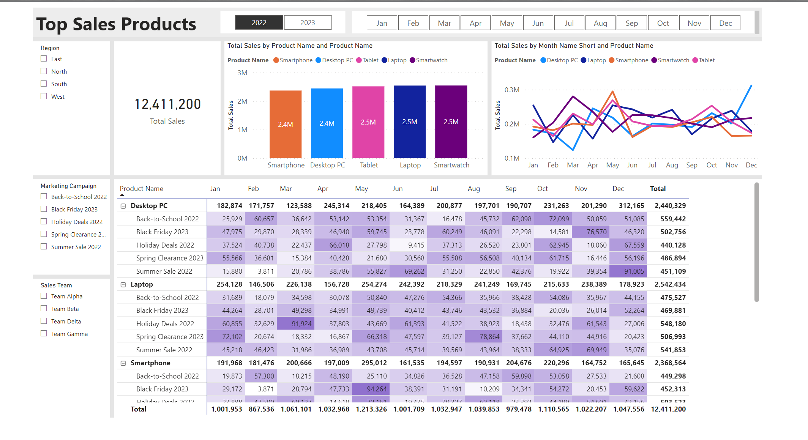
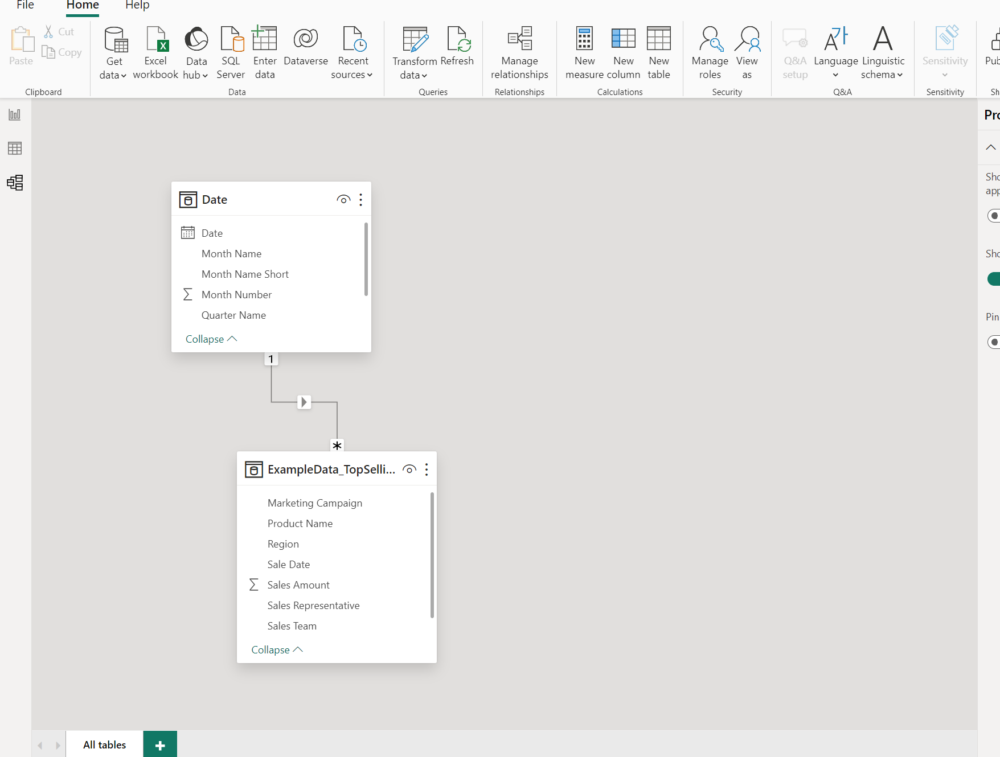

| Top Product Sales Dashboard - Power BI | Data Model Image |
| --- | --- |
|  |  |

# Business Request & User Stories

Email From the Stake Holder : 
Subject: Zooming in on Our Product Stars?

Dear Awesome Data Analyst,

I trust this email finds you well.

Lately, I've been in numerous discussions about our product lineup. We've launched a good number of new products over the past year, and while I hear buzz around several of them, I'm eager to know which ones truly shine in terms of sales.

It would be immensely helpful if you could provide insights into how our products have been performing. Are there specific ones that stand out and consistently dominate the sales charts? Understanding this could guide us in inventory decisions, marketing pushes, and even future product development.

For our next product strategy meeting, having a clear view of our product hierarchy in terms of sales would be instrumental. Your expertise in uncovering these gems from heaps of data is always something I look forward to.

Eagerly awaiting your insights.

Warm regards,

Charlie Thompson
Director of Product Strategy

## User Stories 

Yearly Product Sales Overview: As the Director of Product Strategy, I want an overview of sales for all products launched in the past year to grasp their overall performance.

Highlight Top Performers: As the Director of Product Strategy, I want a list of products that consistently top the sales charts to identify and celebrate our stars.

Visual Representation of Product Sales: As the Director of Product Strategy, I want a visual breakdown (like a bar chart or pie chart) to clearly see the hierarchy of product sales.

Product Sales Trends Over Time: As the Director of Product Strategy, I want to observe the sales trends of newly launched products over time to determine if there's sustained interest or a decline.

Correlation with Marketing Efforts: As the Director of Product Strategy, I want to know if any marketing campaigns or promotions correlate with spikes in sales for our top products to evaluate the effectiveness of our marketing pushes.

## The Selected KPI's 

Top Selling Products: Identifies the Products that Generate the Most Sales Over a Specified Period.

Example: During May, our electronics store sold 500 items. Out of these, 200 were smartphones, 150 were laptops, 100 were headphones, and 50 were smartwatches. Thus, smartphones were our top-selling product for the month.

Application: Recognizing the top selling products allows businesses to understand customer preferences and market demands. This knowledge informs inventory management, promotional campaigns, and future product development, ensuring the company aligns its strategies with what customers are actively seeking and purchasing.

## Analysis and Calculations

In the dataset using DAX i created a separate Date Table for Year, Month Name, Month Name Short, Quarter Name, Quarter Number 
<pre>
  <code>
Date = 
VAR MinYear = YEAR ( MIN ( ExampleData_TopSellingProducts[Sale Date] ) )
VAR MaxYear = YEAR ( MAX ( ExampleData_TopSellingProducts[Sale Date] ) )
RETURN
ADDCOLUMNS (
FILTER (
CALENDARAUTO( ),
AND ( YEAR ( [Date] ) >= MinYear, YEAR ( [Date] ) <= MaxYear )
),
"Year", YEAR ( [Date] ),
"Month Name", FORMAT ( [Date], "mmmm" ),
"Month Name Short", FORMAT ( [Date], "mmm" ),"Month Number",MONTH([Date]),
"Quarter Name" , "Q" & FORMAT([Date], "Q YYYY"),
"Quarter Number" , FORMAT( [Date], "YYYYQ"))
  </code>
</pre>

Created a New DAX measure for Total Sales  
<pre><code> Total Sales = SUM(ExampleData_TopSellingProducts[Sales Amount]) </code></pre>

## Data Model 

This data model has now a Date table and A Fact table connected in a one to many ralationship 

## Top Product Sales Dashboard

The completed Product Sales dashboard has filters for year and month and slicers for Region, Marketing Campaign and Sales Team and a card 
for Total Sales.

Click the image to view the Dashboard

